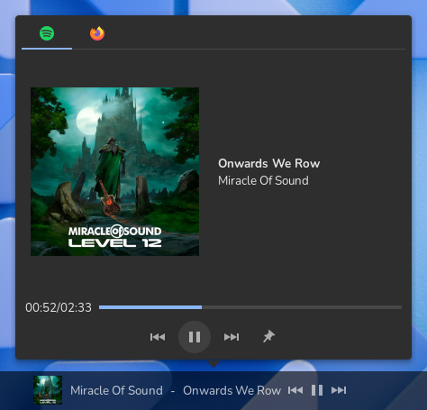

# Budgie Media Player Applet
Applet for the budgie panel for controlling all of your playing media

## Developing
There is a file: `src/testWin.py` that is not used when installing the applet, but it is used for debugging, as it creates the applet in a standalone window.
- If you pass -v it will show the vertical representation of the applet.

This project uses type annotations for better code readability,
they should be:
- on functions and methods
- class instance variables (starting with self.)

This applet targets python 3.9+ so, don't use any newer features.

For formatting, I use [black](https://github.com/psf/black)

## Install
### Install from the budgie extras app
 **Only Ubuntu Budgie 22.04+**

Go into the budgie extras app on ubuntu budgie and install Media Player Applet

### Install from the command line using package manager
**Only Ubuntu 22.04+**

 #### 1. Add the ubuntubudgie/backports ppa
 ~~~ shell
sudo add-apt-repository ppa:ubuntubudgie/backports
~~~
#### 2. Update the package cache
~~~ shell
sudo apt update
~~~
#### 3. Install the applet
~~~ shell
sudo apt install budgie-media-player-applet
~~~

### Build from source
#### 1. Install dependencies
Ubuntu, Debian:
~~~ shell
sudo apt install git meson ninja-build python3-requests python3-gi python3-pil libglib2.0-bin
~~~

Fedora:
~~~ shell
sudo dnf install git meson ninja-build python3-pillow python3-requests python3-gobject
~~~

Arch Linux:
~~~ shell
sudo pacman -S git meson ninja python-requests python-pillow
~~~

openSUSE:
~~~ shell
sudo zypper in git-core ninja meson glib2-tools python3-Pillow python3-requests python3-gobject python3-gobject-Gdk
~~~

 

  <b>
   Full list of dependencies - for other distributions
  </b>
 

 
#### Runtime
- budgie-1.0
- gtk+-3.0
- python3 >= 3.9
- python3-pil / python3-pillow
- python3-requests
- python3-gobject
- gsettings
#### Buildtime
- meson
- ninja
- git
  

#### 2. Download the repository
~~~ shell
git clone https://github.com/zalesyc/budgie-media-player-applet.git && cd budgie-media-player-applet
~~~

#### 3. Build the applet
Ubuntu, Arch Linux
~~~ shell
meson setup build --libdir=/usr/lib
~~~

Fedora, openSUSE
~~~ shell
meson setup build --libdir=/usr/lib64
~~~

#### 4. Install the applet
~~~ shell
cd build && sudo ninja install
~~~

The applet becomes visible only when there is media actively playing.

## Troubleshooting
### Instalation does not work
 - Make sure all dependencies are installed
 - Try again - remove the entire directory cloned with git and start from step 1
 
### The applet cannot be added to the panel or isn't showing up in the panel
Run `budgie-panel --replace` from terminal, this will run the panel and
all of the applets from the terminal displaying any errors.

### The applet is installed but isn't showing in budgie desktop settings
Look into `/usr/lib64/budgie-desktop/plugins` or `/usr/lib/budgie-desktop/plugins`,
is there a `budgie-media-player-applet` directory? are there folders for other applets?

If in neither of theese directories is a `budgie-media-player-applet` directory, try installing the applet again.

If there is only a single directory that is `budgie-media-player-applet`, you may installed the applet in the wrong place, try to look for any other directory named `budgie-desktop` which contains the folders for other applets.

If nothing works try reinstalling from scratch, or try following the steps from the previous categories.
